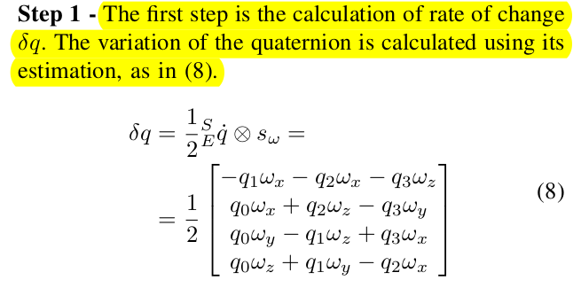
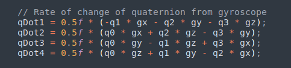
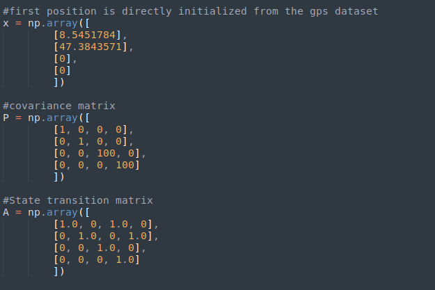

# GPSXIMU
Step by step algorithm and code breakdown for sensor fusion of GPS and IMU

## This is divided into two parts:
	1) IMU SENSOR FUSION
	2) GPS UPADTE IN KALMAN FILTERING STEP

## IMU SENSOR FUSION:
1) Get readings from the IMU sensor.
	a. If the sensor does not contain any magnetometer sensor then go for normal IMU update(6dof)
	b. Else, if your sensor fusion has all the three sensor(accelerometer, gyroscope, magnetometer), i.e, 9dof, go for Madgwick update.
2) read all the datas, (ax,ay,az,gx,gy,gz,mx,my,mz)
3) for (mx,my,mz), we will have to reference the direction of Earth's magnetic field, this is used as a compensation for distortion of earth's magnetic feild, aka, offset calibaration.
4) After that we get cleaned (mx,my,mz)
5) then we will have to pass all the datas in point(2) through an AHRS(Attitude heading and REferance system). This is wgere the sensor fusion occurs.
6) After that we obtain a Quaternion(A four dimensional complex number that can be used to represent the orientation of a rigid body or a coordinate frame in 3-Dimensional space)

7) After that we have to get the pitch, yawm roll, from the quaternion itself.
 
8) From the computed (roll pitch yaw), we will get the rotational matrix to compute the acceleration in the world coordinate.

9) We will get the (Ax, Ay, Az)--> Accleration along world coordinate by multiplying R^-1 and (ax,ay,az). Where R is the obtained rotational matrix.

### INSIDE THE AHRS:
1) Before computing normalization is done in each step,using Fast invere square root. It is just like the unit vector we calculate... unit vector perpendicular to a given vector.

2) STEP 1: 

## GPS UPADTE IN KALMAN FILTERING STEP:

1) Kalman filtering is divided into two steps, Predict and update.
2) In the prediction step we fee in the accelerometer data(Ax, Ay) and we inititalze the initial position directly from the GPS sensor reading.
   Similarly we adjust the initial covariance matrix having initial estimate in its state as less and the initial estimate in its velocity high.

3) From the prediction step we get an initial estimate of waht our position and velocity is in the corresponding X and Y direction.
4) We then pass our initial estimate in the updation step where we use the data from the GPS sensor to further improve our estimate and provide the final output, calculating the kalman gain.
5) I have used other functions like get_X_Y for plotting the data that we are getting using matplotlib to compare the results. 